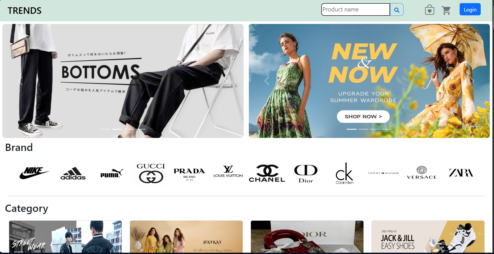
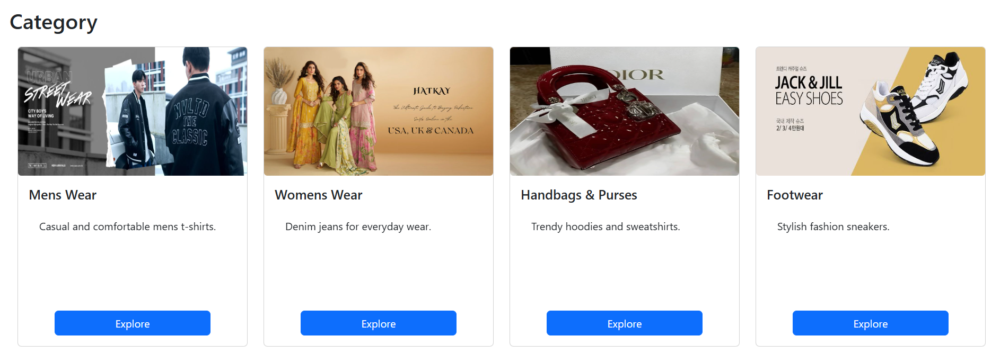
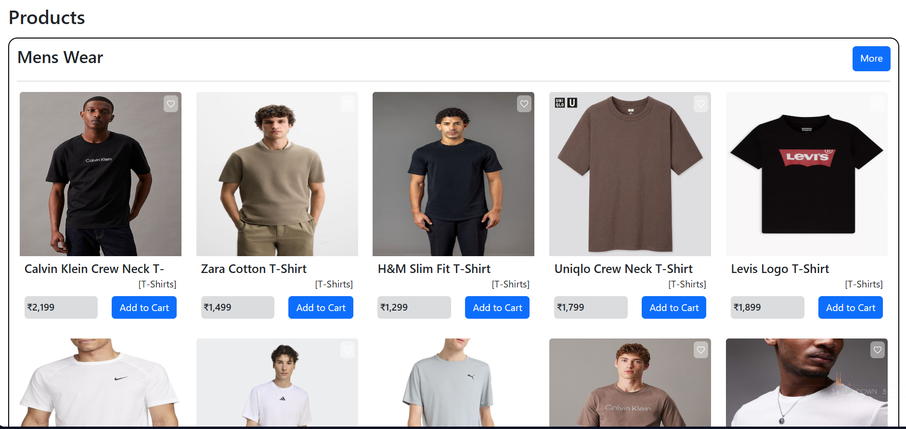
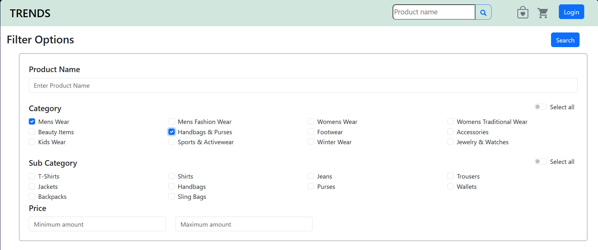

#  TRENDS – Responsive E-Commerce Website

**TRENDS** is a modern, fully responsive e-commerce website designed for fashion and wearable products for **men, women, and kids**. The platform provides a smooth shopping experience with dynamic homepage content and admin-controlled visibility.

---

##  Live Demo

- **Frontend (Vercel):** https://trends-kappa.vercel.app/
- **Backend (Render):** https://trends-d9xb.onrender.com

---

##  Features

-  Fully responsive design (mobile, tablet & desktop)
-  Homepage with featured products
-  Product search functionality
-  Advanced product filtering
-  Wishlist (add / remove items)
-  Cart management
-  User account access (email, username, profile image)
-  Responsive advertisement carousel
-  Admin-controlled homepage content

---

##  Product Categories

### For Men & Women
- Shirts, T-Shirts, Tops  
- Jeans, Pants  
- Kurtis, Sarees  
- Shoes, Heels  
- Purses & Handbags  
- Makeup Kits & Accessories  

### For Kids
- Kids fashion wearables  
- Shoes & accessories  

---

##  Homepage Structure

The homepage is divided into **three main sections**:

### 1. Navigation Bar & Advertisement Carousel
- Navigation bar includes:
  - Product search
  - Wishlist
  - Cart
  - User account details (email, username, profile image)
- Responsive carousel for product advertisements  
- Automatically adjusts to mobile screens  

---

### 2. Main Category Section
- Displays **four main categories**
- Allows users to explore available product categories
- Category visibility is managed by the admin  

---

### 3. Featured Products Section
- Shows selected products on the homepage
- Admin can control:
  - Which products appear
  - Number of products per category
  - Visible categories
  - Advertisements shown  

---

##  Filter Page

The **Filter Page** allows users to refine product listings based on multiple criteria, helping them quickly find what they need.

### Available Filters
-  **Product Name**
-  **Category**
-  **Subcategory** (specific to the selected category)
-  **Price Range / Limit**

Filters can be combined to narrow down results efficiently and update the product list dynamically.

---

##  Admin Controls

The admin has full control over:
- Homepage advertisements
- Visible categories
- Featured products
- Number of products displayed per category
- Products shown in listings and homepage sections

---

##  Purpose of the Project

- Build a scalable fashion e-commerce platform  
- Provide a seamless shopping experience  
- Ensure mobile-first responsiveness  
- Allow easy content management through admin controls  

---

##  Future Enhancements

- Payment gateway integration  
- Order tracking system  
- Product ratings & reviews  
- Admin dashboard analytics  
- Dark mode UI  

---

##  Contributing

Contributions are welcome!  
Fork the repository and submit a pull request.

---

##  License

This project is intended for educational and learning purposes.
